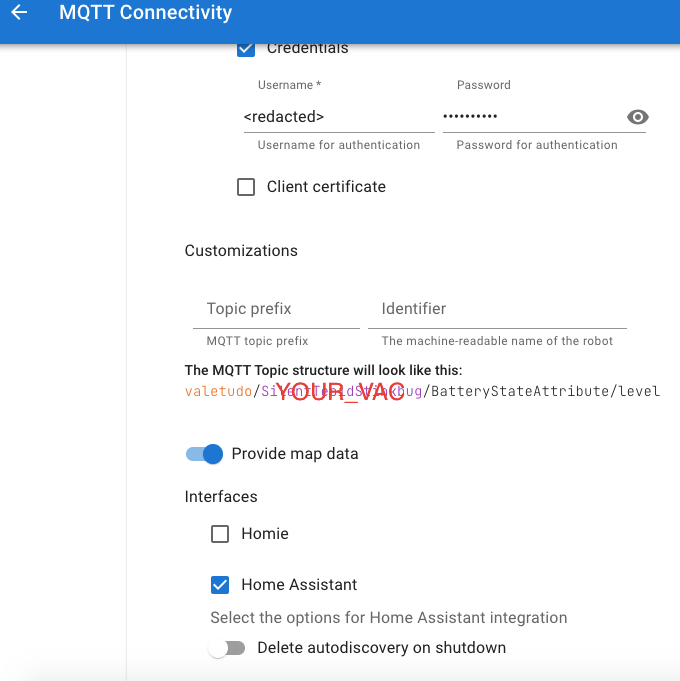

# valetudo_vacuum_mapper
## Integration for Valetudo Vacuums to Home Assistant
<div align="center">
    <a href="https://valetudo.cloud/pages/general/newcomer-guide.html">
    
    </a>
</div>

### Acutal Status is: Tested Camera image retrival


**background idea**:
At today there is the possibility to connect the Vacuum Cleaners with Valetudo Firmware to Home Assistant via MQTT with have limited options. 
This Custom Component allow to integrate the Vacuum functionalities and encode the Vacuum map. 
The integration in the end will provide all sensors and maps data so that is possible to custom select the area to be cleaned, 
go to a specific location, check and reset the consumables counters for maintenance purpose. 

At current only the map can be display simply adding to configuration.yaml:

```
camera:
    - platform: valetudo_vacuum_camera
        vacuum_entity: "vacuum.your_vacuum"
        vacuum_map: "valetudo/your_vacuum_topic"
        MQTT_User: "broker_user_name"
        MQTT_Password: "broker_password"
        scan_interval:
            seconds: 15
```

To know the MQTT topic your_vacuum use you might use the vacuum web GUI.
<div align="center">
  
</div>

To test this custom component we are using a PI4 with Home Assistant OS fully updated [to the last version](https://www.home-assistant.io/faq/release/), this allow
us to confirm that the component is working properly with Home Assistant.
It works when setting the camera with the below card, then it is possible to operate the vacuum and the integration is 
already providing the required calibration data therefore please use
the below link and follow the detailed instruction on how to [setup Piotr Machowski card]( 
https://github.com/PiotrMachowski/lovelace-xiaomi-vacuum-map-card/tree/master).


in the card configuration you might configure as following the 
calibration_source and internal_variables:
```

type: custom:xiaomi-vacuum-map-card
entity: vacuum.valetudo_silenttepidstinkbug
vacuum_platform: Hypfer/Valetudo
map_source:
  camera: camera.valetudo_vacuum_camera
calibration_source:
  camera: true
internal_variables:
  topic: valetudo/your_topic
tiles:
  - tile_id: battery_level
    .....

```
 
After that, you can easily generate the service calls to integrate or control
your Vacuum via Home Assistant. 

**The current tasks list is:**
- [ ] Get from the json data predicted_path and selected_area. 
- [ ] Grab the available consumable data form MQTT.
- [ ] Confirm Reset functions for consumables.
- [ ] Fix config_flow in order to meet HA requirements (including UniqueID).
- [ ] Work out the card to manage the camera image, select area and go to function.

